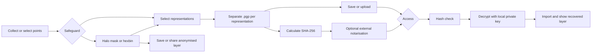
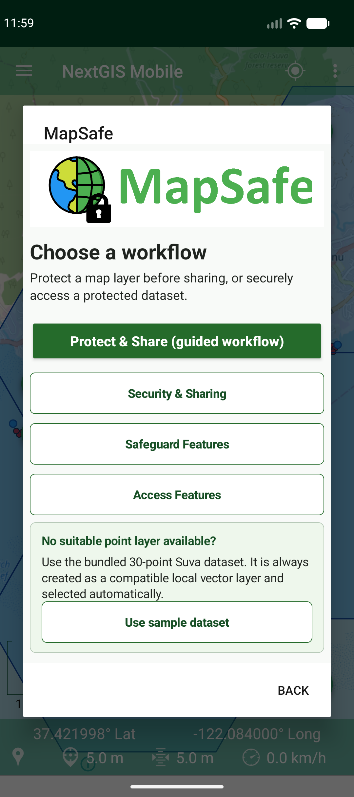
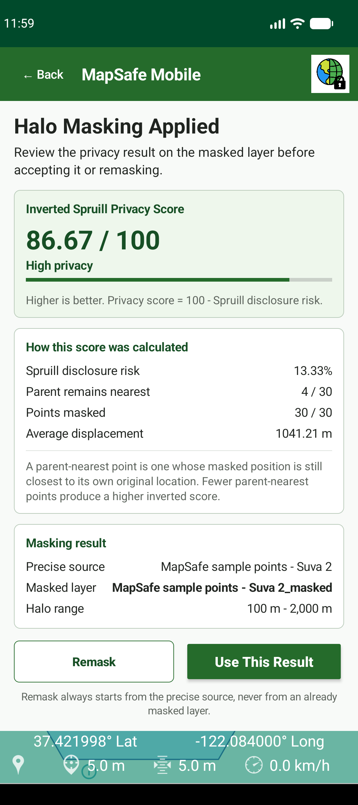
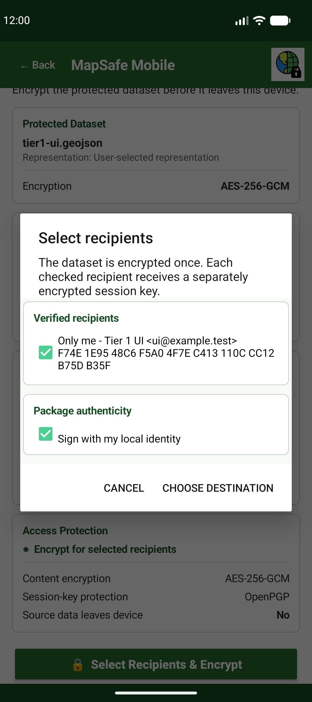

# MapSafe Mobile for NextGIS Mobile

[](LICENSE)
[](https://developer.android.com/)
[-green.svg)](#build-the-research-app)
[](https://github.com/nextgis/nextgisweb)

MapSafe Mobile is a research extension of [NextGIS Mobile](https://github.com/nextgis/android_gisapp) for protecting sensitive geospatial point data at its source. It keeps the original NextGIS field-mapping experience and adds compact **Safeguard**, **Access**, and **Security & Sharing** workflows for anonymisation, multi-recipient OpenPGP encryption, community exchange, integrity checking, and optional blockchain verification.

The app is designed for a two-representation model:

- the **original dataset**, retained for recipients who are authorised to use precise coordinates; and
- an **anonymised dataset**, created either by halo masking or hexagonal binning for a more limited spatial purpose.

It does not create a nested three-level encrypted volume or automatically assign data access from labels such as “trusted”, “semi-trusted”, and “untrusted”. The data owner chooses the suitable representation and recipients for each release.

> **Research status:** the on-device anonymisation, OpenPGP, local file, hash, and recovered-layer workflows are implemented and covered by automated tests. The NextGIS Web exchange has passed a live four-account Premium acceptance run covering member discovery, public-key publication, anonymised-layer sharing, recipient-restricted package download, exact decryption, and outsider denial. Blockchain notarisation is implemented through external-wallet approval, and both submission and Android verification have been exercised against the public Sepolia research deployment.

This repository is the MapSafe research fork. The official NextGIS Mobile packages in Google Play and at my.nextgis.com do not contain these research features.

## Contents

- [Current implementation status](#current-implementation-status)
- [How the app is organised](#how-the-app-is-organised)
- [Safeguard workflow](#safeguard-workflow)
- [Security, identities, and recipients](#security-identities-and-recipients)
- [NextGIS community sharing](#nextgis-community-sharing)
- [Access workflow](#access-workflow)
- [Local storage and artifact handling](#local-storage-and-artifact-handling)
- [Security properties and boundaries](#security-properties-and-boundaries)
- [Inherited NextGIS Mobile capabilities](#inherited-nextgis-mobile-capabilities)
- [Build the research app](#build-the-research-app)
- [Automated testing](#automated-testing)
- [Performance benchmark](#performance-benchmark)
- [Screenshots and manuscript material](#screenshots-and-manuscript-material)
- [Known limitations and remaining work](#known-limitations-and-remaining-work)
- [License and attribution](#license-and-attribution)

## Current implementation status

| Area | Current status |
|---|---|
| NextGIS Mobile field map | Retained. The launcher opens the normal NextGIS Mobile map; MapSafe is opened from the app menu. |
| Halo masking | Implemented and tested with the bundled sample layer and Android instrumentation. |
| Inverted Spruill score | Implemented using a unit-sphere k-d tree and shown after each halo-masking attempt. |
| Hexagonal binning | Implemented with H3 on ARM/ARM64 and a portable emulator fallback; physical ARM validation remains. |
| Save and map review | Implemented for masked, binned, encrypted, and decrypted artifacts in `Downloads/MapSafe`. |
| OpenPGP identity and backup | Implemented with passphrase protection and an additional Android Keystore envelope. |
| Multi-representation encryption | Implemented. Original, halo-masked, and hexagonal-binned datasets can be selected together but are encrypted sequentially into separate packages. |
| Multi-recipient encryption | Implemented with one encrypted payload and one wrapped session key per selected public key in each package. |
| Decryption and map import | Implemented for GeoJSON, including integrity/signature reporting and map zoom handoff. |
| NextGIS key exchange | Implemented and live-tested with three Community A identities plus one external control account on NextGIS Premium. |
| NextGIS layer/package publishing | Implemented and live-tested for community-readable anonymised layers and a Steven/Amber-only encrypted package, including direct-access denial. |
| Community browsing | Implemented public-key sync/review, anonymised GeoJSON download, encrypted-package download, digest check, local save, and verification handoff. |
| SHA-256 integrity checking | Implemented for local and downloaded encrypted packages. |
| EVM network profiles | Implemented for Sepolia, Mainnet, and custom EVM networks, including read-only preflight. |
| Blockchain verification | Read-only retrieval and comparison are implemented for compatible mined transactions. |
| Blockchain notarisation/minting | Implemented through Reown WalletConnect and an external Trust Wallet or MetaMask approval. A replacement Sepolia registry is deployed and a live test mint has been verified. |
| Performance measurements | Reproducible physical-device benchmark is implemented; journal values must come from an actual phone run. |

## How the app is organised

MapSafe is intentionally an optional module inside the normal NextGIS Mobile interface. Opening the Android launcher returns to the standard map rather than jumping directly into a MapSafe screen. From the map menu, **MapSafe** opens one compact screen with **Safeguard** and **Access** tabs:

- **Safeguard** offers Halo Masking, Hexagonal Binning, Encrypt, Upload to Community, and Notarise Package as independent entry points.
- **Access** places Community Packages first and Verify Encrypted File second; decryption follows successful local verification.
- **Security & Sharing**, below the tabs, configures the connected NextGIS account, community group, encryption identity, member public keys, save folder, and blockchain network.
- **Use sample dataset** creates and selects the 23-point North Whangārei infected-tree case-study layer. Its public source coordinates are preserved, while its mobile demonstration attributes are explicitly synthetic.

Halo masking and hexagonal binning require an active map layer and validate its geometry and CRS. Encryption can use related map representations or another file, while Access does not require a preselected map layer because its input is an encrypted package from the community or device storage.



The **Stop** and **Next** actions are present at the workflow handoff points. They orient users without forcing anonymisation, encryption, or blockchain checking into a compulsory wizard: encryption can be opened directly, and a local package can be taken directly to Access.

## Safeguard workflow

### 1. Halo masking

Halo masking, also described as donut masking, creates a new point representation without overwriting the authoritative source layer.

- A two-thumb range slider sets the minimum and maximum displacement from `0` to `5,000` metres.
- A cryptographically secure random generator chooses a displacement in the selected interval and a bearing in `[0, 2π)` for every point.
- Coordinates are calculated on a sphere with a radius of `6,371,000 m`, avoiding planar degree offsets.
- Source attributes are copied to the output, with MapSafe fields recording the source feature ID and masking distances.
- The output is a separately styled blue point layer; the original remains in the map.
- **Remask** always starts from the precise source rather than moving an already masked result.
- The applied-results card can collapse upward so the map occupies most of the screen.
- **Save Layer**, **Upload to Community**, **Stop**, and **Next: Encrypt** are available from the result screen.

MapSafe automatically calculates Spruill’s parent-nearest disclosure-risk measure for the candidate. The interface displays its inverse:

```text
privacy score = 100 − Spruill disclosure risk
```

A higher score therefore communicates a lower parent-nearest disclosure risk. The nearest-neighbour search uses three-dimensional unit-sphere coordinates and treats an equal-distance tie containing the parent as parent-nearest. The score is an aid for comparing candidates; it is not a guarantee of anonymity.

### 2. Hexagonal binning

Hexagonal binning aggregates points into counted polygon cells so recipients can inspect spatial distribution rather than exact coordinates.

- The user selects an indexing resolution from `0` to `15`; the default is `8`.
- ARM and ARM64 devices use Uber H3 through `h3-java 4.1.1`.
- x86 and x86_64 emulators use a native-free Web Mercator hex-grid fallback so the workflow remains testable.
- One polygon is created for each occupied cell.
- Output fields include `cell_id`, `engine`, `point_count`, and `resolution`.
- The generated blue polygon layer is separate from the source and can be inspected with the result card expanded or collapsed.
- **Bin Again**, **Save Layer**, **Upload to Community**, **Stop**, and **Next: Encrypt** are available from the result screen.

This mobile implementation creates one anonymised binning result for the selected resolution. It does not automatically generate two coarseness levels or apply the buffer-radius rule used by earlier MapSafe prototypes.

### Supported MapSafe map input

Halo masking and hexagonal binning require a selected NextGIS point vector layer containing readable features. Their spatial code supports EPSG:4326 and EPSG:3857. The general encryption exporter supports NextGIS vector geometry that can be converted to WGS84 GeoJSON, but also rejects unsupported source CRS values rather than silently writing incorrect coordinates.

### Choosing what is encrypted

The **Encrypt** entry lists the selected original dataset and its related halo-masked and hexagonal-binned map layers. The user may select one, two, or all available representations; the original is checked by default. A result-screen **Next: Encrypt** handoff carries that displayed anonymised result directly, while **Choose** still permits an intentional file change.

Selected representations are never nested together. MapSafe queues them and creates one `.pgp` package per dataset, returning to recipient selection before each encryption so different representations can be authorised for different people.

## Security, identities, and recipients

### Persistent local OpenPGP identity

MapSafe can create one local identity per installation from a name, organisation, optional email address, and recovery passphrase of at least 12 characters. New identities use:

- an RSA-3072 primary key for certification and signing;
- an RSA-3072 encryption subkey;
- SHA-256 signatures;
- an iterated-and-salted SHA-256 S2K for the transferable secret keyring; and
- version-4 transferable OpenPGP keys.

The passphrase-protected secret keyring is stored in app-private storage and is additionally encrypted with AES-GCM using a non-exportable Android Keystore key. The recovery passphrase is not stored. MapSafe detects this identity after an app restart, shows its identity/fingerprint, and does not require a new key pair for each encryption.

The user can explicitly export:

- the public key, for exchange with recipients; and
- a passphrase-protected private-key backup, which is essential before uninstalling the app, clearing its storage, resetting the device, or losing the phone.

Private-key backups must be handled as sensitive material. The public `Downloads/MapSafe` dataset folder is not used as the automatic private-key store.

### Recipient selection and encryption

Creating an identity returns the user to Encrypt & Protect. It does not immediately encrypt the dataset. Recipient selection then supports:

- the user’s own identity only;
- one or more imported/community recipient keys only; or
- the user’s identity and any number of other recipients.

The local identity is selected by default so the sender can normally recover their own package, but it may be unchecked. Other keys can be imported from a file or synchronised from the selected NextGIS community. If encryption has already succeeded, **Reselect Recipients & Encrypt** creates another package with a revised recipient set. In a multi-dataset queue, **Next: Encrypt** advances to the next representation and asks for its recipient set independently.

MapSafe uses standard hybrid OpenPGP encryption rather than directly encrypting the whole dataset with RSA:

1. the selected dataset is compressed;
2. one fresh AES-256 session key encrypts the payload once;
3. that same session key is independently encrypted to each checked recipient’s RSA encryption subkey; and
4. the recipient-specific session-key packets and encrypted payload are written into one binary `.pgp` file.

New packages use the RFC 9580 v2 SEIPD AES-256-GCM profile with v6 PKESK packets. Earlier MapSafe AES-256/OpenPGP-MDC packages remain decryptable. Signing is optional and is reported independently from encryption integrity.

Each selected recipient opens the same `.pgp` file with their own private key and passphrase. The OpenPGP engine unwraps the AES session key and decrypts the payload automatically; the user does not receive or operate a separate session-key file.

## NextGIS community sharing

MapSafe reuses a NextGIS Web account already connected through NextGIS Mobile. **Security & Sharing** can:

- choose a connected account;
- open the standard NextGIS account-management screen;
- list the authentication groups to which the signed-in user belongs;
- attempt to create a real authentication group with the current user as its first member, where server permissions allow it;
- create or restore the local OpenPGP identity;
- publish only the user’s public key;
- synchronise current group members’ public keys;
- review and accept new or changed fingerprints;
- open the fixed MapSafe save folder; and
- select an Ethereum Sepolia, Ethereum Mainnet, or custom EVM network profile.

Subscriptions, NextGIS ID team invitations, acceptance of invitations, adding or removing members, compromised-account response, server storage policy, and detailed resource ACL administration are best completed before fieldwork by an authorised administrator in NextGIS Web. Group membership and resource permission are separate: belonging to an authentication group does not by itself guarantee access to every Web GIS resource.

### Community resource model

The NextGIS ID team, the Web GIS authentication group, and the Web GIS resources have distinct roles. The team controls access to the Web GIS account, membership of the selected authentication group defines the MapSafe community, and the resource ACL determines what those members may read or publish. MapSafe creates or discovers one hierarchy for that selected group:

```text
MapSafe
└── <selected authentication group>
    ├── Public Keys
    │   └── <member publishing folder>
    │       └── public-key registry and `.asc` attachment
    ├── Anonymised Datasets
    │   └── <member publishing folder>
    │       ├── halo-masked vector resources
    │       └── hexagonal-binned vector resources
    └── Encrypted Packages
        └── <member publishing folder>
            └── one recipient-restricted registry per encrypted package
```

- Public keys are stored as public-only OpenPGP material with a manifest and fingerprint under **Public Keys**. Private keys and passphrases are rejected.
- Halo-masked and hexagonal-binned GeoJSON are uploaded as native NextGIS vector resources.
- Encrypted `.pgp` contents are stored as opaque attachments. Each package receives its own non-propagating ACL so only its publisher and the NextGIS users mapped to the selected OpenPGP fingerprints may list and download it.
- Encrypted-package metadata includes an opaque record ID, SHA-256, publisher and group IDs, recipient user IDs and fingerprints, creation time, status, and reserved network/transaction fields.
- After a wallet-approved transaction is mined and its record matches the local package hash, MapSafe updates matching package records owned by the current publisher with the network, contract, transaction hash, and explorer URL.
- The community attachment keeps the safe encrypted-package basename so the downloaded package can be compared with the filename bound into a notarisation record.
- Before upload, MapSafe resolves every encrypted recipient to an accepted key belonging to a current community member, displays the resulting audience for confirmation, and fails closed if any fingerprint cannot be mapped.
- When a hierarchy created by the earlier Free-plan prototype is first used on Premium, the administrator removes the legacy public root-read inheritance, repairs the MapSafe descriptions, and provisions an isolated publishing folder for each current community member. Members can manage only their own folder descendants; shared directories remain read-only and package ACLs remain recipient-specific.

### Public-key trust

NextGIS Web is used for discovery and distribution, not as proof that a key belongs to a person. Before a community key becomes selectable, MapSafe validates its manifest, member and publisher IDs, key fingerprint, and usable encryption subkey. The user must then compare and accept the complete fingerprint through an independent channel.

Accepted fingerprints are pinned locally and can be used offline. A changed fingerprint, removed member, revoked or missing record, ownership mismatch, or duplicate active record is quarantined from new encryption instead of being silently substituted. Removing someone from a group cannot revoke a package that was already encrypted for that person.

### Community Access

The Safeguard tab's **Upload to Community** action accepts the local public key and any combination of available halo-masked layers, hexagonal-binned layers, and encrypted packages already in `Downloads/MapSafe`; it deliberately excludes the unencrypted original. **Community Packages** lists every authorised MapSafe category: public keys are synchronised to the protected local key cache for fingerprint review, anonymised vector resources can be downloaded as GeoJSON, and encrypted packages can be downloaded to `Downloads/MapSafe`. A selected package is hashed locally, compared with the registry SHA-256, and handed to Verification; users may also choose a `.pgp` file directly from device storage.

## Access workflow

### 1. Verify

Verification reads the encrypted package and calculates its SHA-256 locally. The **Next: Decrypt** action becomes available when a file and valid local digest exist because blockchain anchoring is optional.

If a compatible external transaction exists, the user may enter either its `0x` transaction hash or the canonical explorer URL for the active profile. The read-only verifier:

- rejects malformed, insecure, cross-network, credential-bearing, or wrong-origin references before network access;
- retrieves the active chain ID, transaction, and receipt over HTTPS JSON-RPC;
- checks the configured network and contract;
- requires a mined, successful, zero-value `mintNFT(string)` call;
- strictly ABI-decodes the integrity record; and
- compares both the recorded package basename and digest with the selected package and its locally calculated SHA-256.

New MapSafe records bind the encrypted-package basename to its content hash:

```text
<encrypted-package filename>_<64 lowercase hexadecimal characters>
```

Only the safe basename is recorded, never a device path. The verifier also recognises the earlier hash-only `mapsafe:v1:sha256:<SHA-256>` form for read-only compatibility. A mined transaction immutably records that its signing account asserted the filename/hash pair at that time; it does not prevent another transaction from making a different assertion, establish who controlled the wallet, calculate confirmation depth, or independently establish chain finality.

### 2. Decrypt

The carried file is hashed again before the private-key prompt so a file changed after verification cannot be released as plaintext. MapSafe then:

- finds a local secret key matching one of the package recipients;
- uses the recovery passphrase to unlock it;
- unwraps the AES session key and decrypts the payload as one operation;
- withholds output until OpenPGP AEAD/MDC integrity succeeds; and
- reports signature status as valid, invalid, unknown signer, or unsigned.

An invalidly signed GeoJSON is not offered for map import. Unsigned packages and packages from unknown signers show their authenticity limitation before import.

After successful decryption, the action button is removed, the recovered file is saved in `Downloads/MapSafe`, and GeoJSON can be imported as a local NextGIS vector layer. The app selects the newly imported layer and zooms to its extent instead of requiring a separate dataset catalogue selection.

### 3. Blockchain configuration boundary

Network configuration is shared by Notarise and Verify and is managed from **Security & Sharing**. Profiles contain a display name, environment, chain ID, HTTPS RPC endpoint, explorer origin, contract address, and contract-interface profile. They are encrypted with Android Keystore in app-private no-backup storage. Activating a production network requires explicit acknowledgement.

The preflight is read-only: it checks `eth_chainId`, deployed bytecode with `eth_getCode`, expected MapSafe selectors, and ERC-721 support where applicable. The QGIS prototype’s historical Sepolia destination and MapSafe's earlier hash-only registry are retained only for legacy verification. New Sepolia notarisation uses the filename-bound MapSafe integrity registry at `0xdF7efaA8f01B5674e41534Da2bA4D7C56f65A0F2`.

The Notarise screen automatically receives the encrypted file from the previous step, calculates its SHA-256, and shows the active network. It connects to an installed Trust Wallet or MetaMask through Reown WalletConnect, builds a zero-value `eth_sendTransaction` call, and opens the wallet for explicit approval. After submission, MapSafe retrieves the receipt and accepts the notarisation only when the mined transaction decodes to the same canonical filename and SHA-256 record. MapSafe does **not** request, import, or store an Ethereum private key or recovery phrase; transaction signing and gas approval remain inside the wallet.

Wallet-enabled builds read the public Reown project identifier from the `MAPSAFE_REOWN_PROJECT_ID` Gradle property, environment variable, or ignored local `mapsafe.properties` file. See `mapsafe.properties.example`. The reference contract source, reproducible deployment scripts, public deployment receipt, and live-mint receipt are under [`tools/mapsafe-contract`](tools/mapsafe-contract/README.md).

See [the blockchain contract profile](app/src/main/java/com/nextgis/mobile/mapsafe/BLOCKCHAIN_CONTRACT.md) for the exact ABI and record-validation rules.

## Local storage and artifact handling

Normal MapSafe outputs use the fixed public folder shown in Android Files as:

```text
Files > Downloads > MapSafe
```

The folder is created automatically or from Security & Sharing. Result screens display the compact `Saved: <filename>` message and an **Open Folder** action rather than the full path.

| Artifact | Handling |
|---|---|
| Precise source layer | Remains in the NextGIS map; anonymisation does not overwrite it. |
| Masked layer | Separate local point layer; exportable as WGS84 GeoJSON; optionally publishable as a native community resource. |
| Hexbin layer | Separate local polygon layer; exportable as WGS84 GeoJSON; optionally publishable as a native community resource. |
| Encrypted package | Binary `.pgp` file saved to `Downloads/MapSafe`; optionally uploaded as an opaque community attachment whose safe basename is retained. |
| Decrypted file | First written to app-private temporary storage, released to `Downloads/MapSafe` only after integrity succeeds, then optionally imported. |
| Local private key | Passphrase-protected and Android-Keystore-wrapped in app-private storage; never automatically placed in the public save folder. |
| Public key | Exportable and publishable to the selected community. |
| Private-key backup | Exported only through an explicit protected-backup action to a user-chosen secure destination. |
| Blockchain/network settings | Android-Keystore-encrypted app-private no-backup data. |

Map-layer encryption first exports the selected vector layer to an app-cache WGS84 GeoJSON file, streams it into OpenPGP, and deletes the temporary export. Decryption similarly uses an app-cache temporary file and removes partial output on failure.

## Security properties and boundaries

MapSafe is designed to reduce avoidable disclosure while keeping authority with the data owner:

- precise processing, private-key use, encryption, hashing, and decryption occur on the Android device;
- only public keys, deliberately anonymised layers, encrypted packages, and non-secret metadata are eligible for community upload;
- the safe encrypted-package basename and SHA-256 are public and permanent in a notarisation record, while the device path is excluded;
- private keys, passphrases, plaintext datasets, and OpenPGP session keys are not written to a blockchain;
- recipient selection is explicit for every encryption; community membership does not automatically grant precise-data access;
- the OpenPGP passphrase and key-management activities use Android `FLAG_SECURE` during sensitive entry; and
- algorithmic integrity and sender authenticity are reported separately.

Important boundaries remain:

- anonymisation reduces location precision but does not guarantee anonymity or remove sensitive non-spatial attributes;
- a legitimate recipient can copy or redistribute decrypted plaintext;
- a recipient removed later may still decrypt packages previously addressed to their key;
- NextGIS Web administrators and server operators remain part of the operational trust model for hosted resources and metadata;
- a server-hosted public key is not trusted until its fingerprint is checked independently;
- Android/JVM cannot guarantee erasure of every transient in-memory key copy; and
- clearing app storage removes the local identity and Android Keystore state, making a protected backup essential.

For more detail, see [the OpenPGP design and custody notes](MAPSAFE_OPENPGP.md).

## Inherited NextGIS Mobile capabilities

The research module is built into the existing open-source NextGIS Mobile application. The underlying app continues to provide:

- field collection and editing of points, lines, polygons, attributes, and photos;
- offline maps and local vector layers;
- NextGIS Web account, resource, and synchronisation support;
- interactive map visualisation and layer control;
- GPS positioning and track recording; and
- local data-management and search tools.

General NextGIS Mobile documentation is available in the [official user guide](https://docs.nextgis.com/docs_ngmobile/source/index.html). Upstream functionality and services remain the responsibility of the NextGIS project; MapSafe-specific behaviour is maintained in this research fork.

## Build the research app

### Requirements

- Windows PowerShell or a shell capable of invoking the Gradle wrapper
- Git with access to the repository submodules
- Android Studio and Android SDK Platform 36
- JDK 21
- an Android device or emulator running API 26 or later
- a local `sentry.properties` file containing a non-empty development Sentry DSN; this file is ignored and must not be committed

The current application version is `3.2.1` (`versionCode 199`). Debug builds use application ID `com.nextgis.mobile.debug` and display as **DEV NextGIS Mobile**.

Clone and initialise the upstream library submodules:

```powershell
git clone https://github.com/sharmapn/nextgis_mobile_mapsafe_geoprivacy.git
Set-Location nextgis_mobile_mapsafe_geoprivacy
git submodule update --init --recursive
```

The submodule URLs currently use GitHub SSH, so GitHub SSH access must be configured for the submodule step. Android Studio normally creates `local.properties` with `sdk.dir`. Create the ignored Sentry configuration separately:

```properties
sentry.dsn=<your-development-sentry-dsn>
```

Build the debug APK:

```powershell
.\gradlew.bat --no-daemon :app:assembleDebug
```

The APK is written to:

```text
app/build/outputs/apk/debug/app-debug.apk
```

Install it on a connected device or emulator:

```powershell
adb install -r app\build\outputs\apk\debug\app-debug.apk
```

The launcher opens the normal NextGIS Mobile map. Use the app menu and choose **MapSafe** to enter the research workflows. A NextGIS login is not required for local masking, binning, encryption, hashing, or decryption; it is required for community key and artifact exchange.

## Automated testing

The PowerShell test runner supports local JVM tests, scenario tests, and connected Android instrumentation:

```powershell
# Default: all JVM unit and workflow tests
.\scripts\run-mapsafe-tests.ps1

# Console-friendly workflow scenarios
.\scripts\run-mapsafe-tests.ps1 -Suite Scenario

# Connected Pixel_9a emulator or attached device
.\scripts\run-mapsafe-tests.ps1 -Suite Device

# Unit followed by connected-device tests
.\scripts\run-mapsafe-tests.ps1 -Suite All

# Use another AVD
.\scripts\run-mapsafe-tests.ps1 -Suite Device -Avd My_AVD

# Use an already-connected device and preserve its current app data
.\scripts\run-mapsafe-tests.ps1 -Suite Device -NoStartEmulator

# Deliberately erase app data, identity files, and Keystore state first
.\scripts\run-mapsafe-tests.ps1 -Suite Device -ResetAppData
```

Device tests exercise the real MainActivity/map controls, sample layer, halo masking, Spruill calculation, hexbinning, collapsible panels, fixed save folder, identity persistence, recipient selection, multi-recipient encryption, tamper rejection, decryption, signature reporting, GeoJSON import, map selection/zoom, navigation, and manuscript screenshots.

Tier 1 uses controlled NextGIS directory observations and an in-memory test ledger; its output labels these stages `SIMULATED`. Live NextGIS authentication/resource behaviour and real blockchain submission are not claimed by those tests.

Reports are written to:

```text
app/build/reports/tests/testDebugUnitTest/index.html
app/build/reports/androidTests/connected/debug/index.html
app/build/reports/mapsafe-device/screenshots/
```

See [MAPSAFE_TESTING.md](MAPSAFE_TESTING.md) for suite behaviour and reports.

The [Premium trial runbook](paper/mapsafe-results/premium-trial/README.md) contains the
four-role ACL matrix, preflight command, opt-in multi-account test, screenshot list,
and deferred narration/capture scripts.

## Performance benchmark

An Android instrumentation benchmark generates realistic field datasets containing `50`, `250`, `500`, `1,000`, and `2,000` points. The 2,000-point pair is retained as a stress-test reference beyond the expected field-collection range. Each point count has both a typical and rich-text version with the same 18-field attribute schema, allowing encryption/decryption to be compared at different file sizes without changing the number of points. For every dataset it records:

- halo masking without Spruill assessment;
- halo masking followed by Spruill assessment;
- signed RFC 9580 AES-256-GCM OpenPGP encryption for one RSA-3072 recipient; and
- private-key unlock, decryption, integrity checking, and signature verification.

The paper protocol uses five warm-up runs followed by 30 measured runs in shuffled order. UI interaction, file selection, key generation, recipient discovery, and network activity are excluded. The normal runner refuses emulator measurements so journal performance values come from a named physical phone.

```powershell
# Preliminary pipeline and comparison run on an emulator
.\scripts\run-mapsafe-performance-benchmark.ps1 -Protocol Quick -AllowEmulator

# Publication protocol on a connected physical phone
.\scripts\run-mapsafe-performance-benchmark.ps1

# When more than one phone is connected
.\scripts\run-mapsafe-performance-benchmark.ps1 -Serial <adb-serial> -Protocol Paper
```

It saves the exact generated GeoJSON files and produces a dataset manifest, raw CSV, summary CSV, environment metadata, and a LaTeX table under `app/build/reports/mapsafe-performance/`. Emulator metadata is explicitly marked `publication_eligible=false`. No benchmark values should be reported as mobile-device performance until the paper protocol has been run on the intended physical test phone.

See [MAPSAFE_BENCHMARKING.md](MAPSAFE_BENCHMARKING.md) for the attribute schema, NextGIS attachment boundary, reusable commands, outputs, and interpretation rules.

Successful operations performed through the normal phone UI are also appended
to `Downloads/MapSafe/mapsafe-performance-log.csv`. The cumulative log records
masking with and without the Spruill stage, OpenPGP encryption, and verified
decryption together with dataset/file identifiers, available point and byte
counts, elapsed milliseconds, device, Android, and app-version metadata. Every
successful operation is appended to the same `mapsafe-performance-log.csv`;
the file header is written once. Logging happens after the timed section and
cannot turn an otherwise successful workflow into a failure.

Retrieve and summarise that cumulative physical-phone log with:

```powershell
.\scripts\pull-mapsafe-phone-performance-log.ps1
```

## Screenshots and manuscript material

The repository includes a publication screenshot set covering configuration, safeguard, encryption, notarisation, verification, decryption, and map results:

- [paper-result notes and figure inventory](paper/mapsafe-results/README.md)
- [publication screenshot folder](paper/mapsafe-results/screenshots/)
- [LaTeX results section](paper/mapsafe-results/mapsafe_results.tex)

<p align="center">
  
  
  
</p>

Secret-entry screens are protected from normal capture. Manuscript tests use disposable identities and synthetic data; production private keys must never be used in automation.

## Known limitations and remaining work

The principal release and research tasks still open are:

- validate H3 on a physical ARM/ARM64 Android phone;
- repeat the validated multi-account `.pgp` exchange on independent physical Android installations rather than role-switching one emulator;
- validate new RFC 9580 packages with external GnuPG/OpenKeychain versions that support the profile;
- validate fingerprint rotation and member removal against the live Premium hierarchy;
- add background/scheduled public-key synchronisation;
- add a key-revocation-certificate workflow and an organisational certification policy;
- independently audit the deployed MapSafe integrity contract and pin approved runtime-code hashes before production use;
- complete an interactive WalletConnect approval test on each supported production wallet and physical-device configuration;
- live-test automatic community-record updates after a wallet-approved notarisation; and
- run the physical-device performance protocol and insert the measured results into the manuscript.

Selected-layer packages currently use GeoJSON and do not include file attachments, renderer/style definitions, edit-form configuration, or every piece of original NextGIS resource metadata. The emulator has also shown unreliable NextGIS account login in development; live authentication should be confirmed on a physical phone before a field deployment.

This prototype should be independently reviewed and tested before it is used with real culturally, ecologically, legally, or commercially sensitive data.

## License and attribution

This repository is licensed under the [GNU General Public License version 3 or later](LICENSE), following the licence notices in the source tree.

MapSafe Mobile builds on [NextGIS Mobile](https://github.com/nextgis/android_gisapp), [NextGIS Web](https://github.com/nextgis/nextgisweb), [Bouncy Castle](https://www.bouncycastle.org/), and [Uber H3](https://h3geo.org/). NextGIS Mobile and the NextGIS name belong to their respective upstream project and maintainers. This research fork is not an official NextGIS release.

For upstream NextGIS documentation, community support, and services:

- [NextGIS Mobile documentation](https://docs.nextgis.com/docs_ngmobile/source/index.html)
- [NextGIS community forum](https://community.nextgis.com)
- [NextGIS website](https://nextgis.com)
